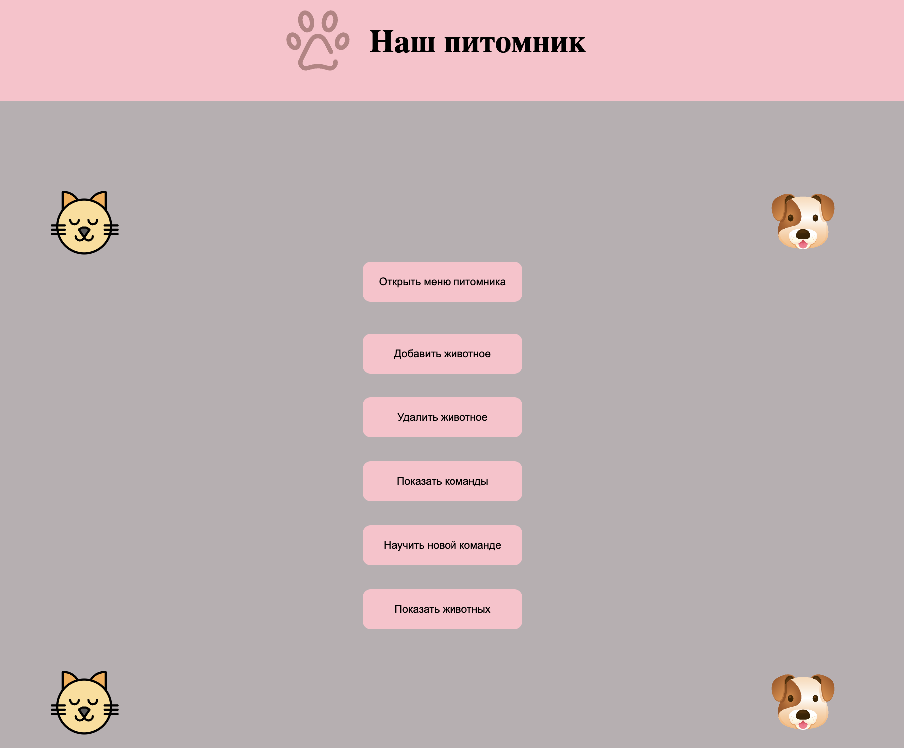

Репозиторий с итоговой контрольной работой.
Необходимо организовать систему учета для питомника в котором живут домашние и вьючные животные.

Итоговая работа разделена мной на блоки: 
1. Блок Linux (файлы находятся в одноименной папке): задания с 1 по 5.
2. Блок MySql (файлы находятся в одноименной папке): задания с 7 по 13.
3. Блок JavaScript (файлы находятся в папке "JS"): задание 14.

    Данная программа умеет:
    + Добавлять животное
    + Удалять животное
    + Показывать список всех животных в питомнике
    + Показывать команды, которое умеет животное 
    + Обучать новым командам

    
